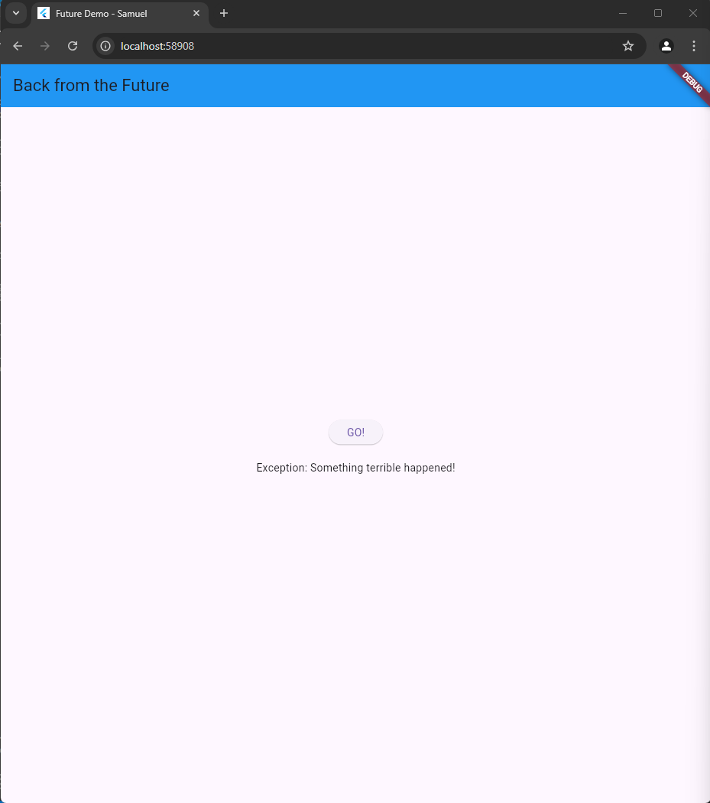

NAMA    : SAMUEL RIVALDO SARAGIH
KELAS   : 2B TRPL
NIM     : 362358302156

# PRAKTIKUM 1

# PRAKTIKUM 2

# PRAKTIKUM 3

# PRAKTIKUM 4

# Future.wait

Fungsi: Menunggu beberapa tugas (Future) sekaligus.
Cara kerja: Semua tugas harus diberikan dalam satu daftar. Selesai ketika semua tugas selesai.
Kesalahan: Jika satu tugas gagal, akan langsung mengembalikan kesalahan.

# FutureGroup

Fungsi: Menunggu beberapa tugas, tetapi bisa menambahkan tugas satu per satu.
Cara kerja: Tugas ditambahkan secara dinamis. Setelah semua ditambahkan, panggil close untuk menunggu selesai.
Kesalahan: Jika ada tugas yang gagal, tetap bisa menambahkan tugas baru.

# PRAKTIKUM 5

hasil dari prsaktikum 5 hasilnya beda sama dengann yang ada di modul
